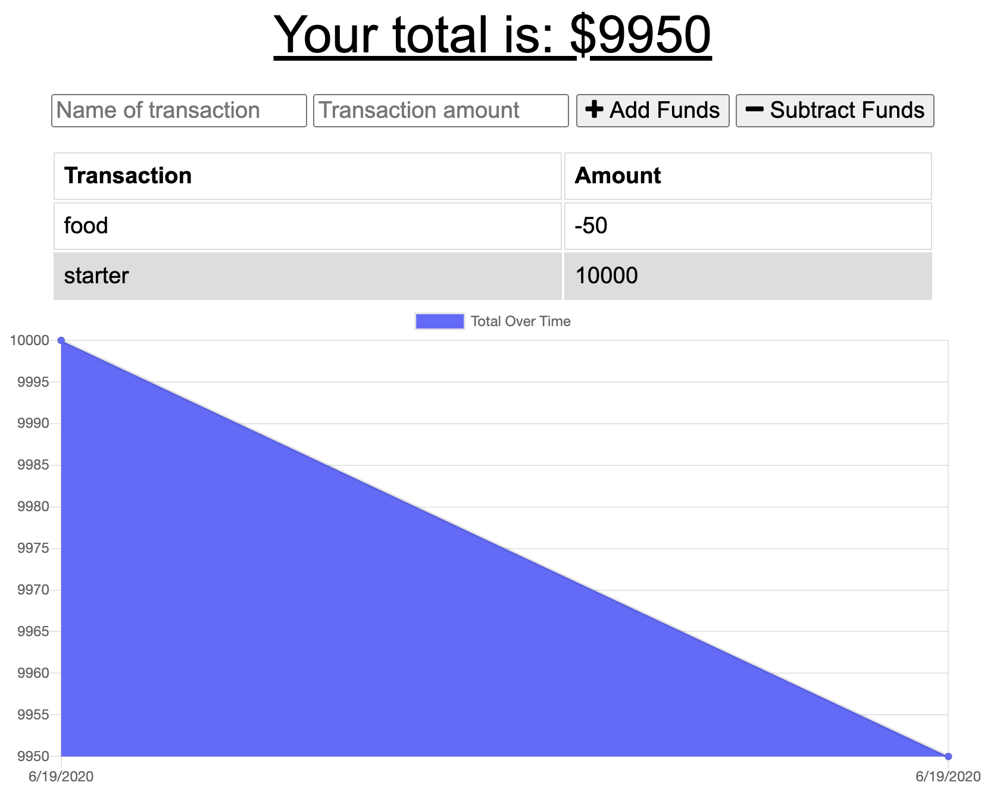

  # Budget Tracker
  
  ## Description
  Budget Tracker is a Progressive Web Application that allows the user to record and track budget deposits and expenses online and offline.

  ## Contributing
  
  I completed this Bootcamp assignment on my own with the help of my Bootcamp instructor, TA, and fellow classmates. Languages and Frameworks Used: JavaScript, Node.js, jQuery, MongoDB
  
  ## Questions
  
  Please contact [sharlenemay](https://github.com/sharlenemay) at sharleneminosa@gmail.com for questions.